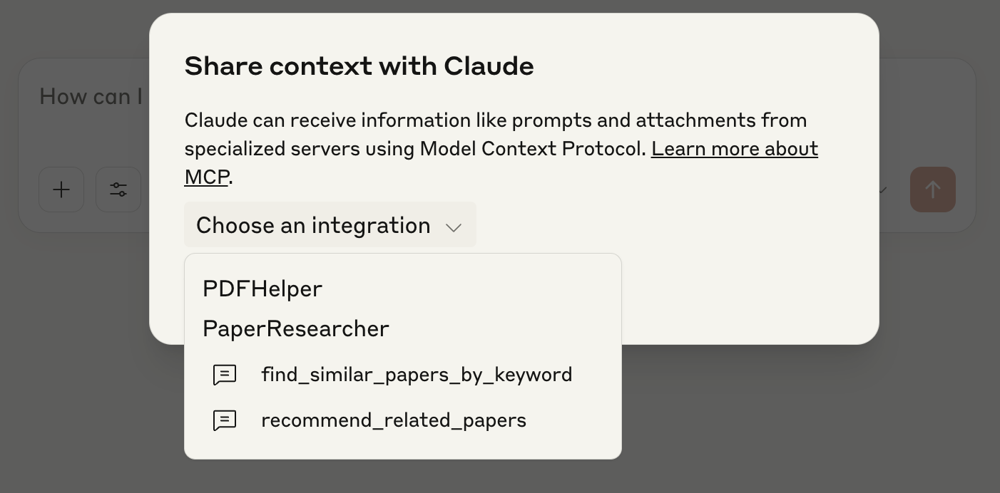

# PaperMate

**PaperMate** is an all-in-one toolkit designed to streamline your academic workflow. Whether you're searching for papers, looking for similar research, or converting PDF files into editable Word documents, PaperMate has you covered.

## 📚 Table of Contents

- [Features](#-features)
- [Requirements](#-requirements)
- [Installation](#-installation)
- [Integration Note](#-integration-note)
- [Setup Guide for Tavily Integration](#-setup-guide-for-tavily-integration-with-papermate)
- [Usage with Claude Desktop App](#usage-with-claude-desktop-app) 

### ✨ Features
- 🔍 Search academic papers easily
- 🧠 Find similar or related papers
- 📄 Convert paper PDFs to Word format

### 📦 Requirements
- Python >= 3.13
- Node.js >= 20
- Claude Desktop App
- Tavily API key

### 🚀 Installation
PaperMate requires **Python 3.13.2** and **Node.js 20+**.

1. Clone the repository:
```bash
git clone https://github.com/your-username/papermate.git
cd papermate
```

2. Install dependencies and create a virtual environment using uv:

```bash
uv venv 
uv sync
```

💡 **Note**  
Don’t have uv yet? Install it with:
```bash
curl -Ls https://astral.sh/uv/install.sh | sh
```

💡 **Note**  
uv sync automatically installs from requirements.txt if no pyproject.toml is found.


🔧 **Integration Note**  
PaperMate's paper search and recommendation features are powered by `@mcp.prompt` functions and work seamlessly with the **Claude Desktop app**.  
To enable internet-based academic search, you must connect the **Tavily Search API** by adding your Tavily API key in the Claude Desktop app's **API Keys** settings.


### 📄 Setup Guide for Tavily Integration with PaperMate
This guide explains how to enable internet-based academic search in PaperMate by integrating the [Tavily Search API](https://tavily.com/) using the Claude Desktop app.

#### 🔧 Step 1: Prepare Your Environment
Make sure you have Node.js v20 or higher installed.
```bash
node -v
```
If not, download and install it from [nodejs](https://nodejs.org).

#### 📂 Step 2: Update Claude Desktop Configuration
Open the following configuration file (replacing {username} with your real username):

```bash
/Users/{username}/Library/Application Support/Claude/claude_desktop_config.json
```

Add the following configuration block (replacing "{your API key}" with your real Tavily API key):

```json
{
  "mcpServers": {
    "tavily-mcp": {
      "command": "npx",
      "args": [
        "-y",
        "tavily-mcp@0.1.3"
      ],
      "env": {
        "TAVILY_API_KEY": "{your API key}"
      }
    }
  }
}
```

💡 **Note**  
If you already have other mcpServers defined, just merge this block into the existing JSON.

🎉 You're all set! PaperMate is now ready to fetch and recommend papers using real-time web search via Tavily.

Once this is set up, PaperMate will be able to search for and recommend academic papers using Tavily's web search capabilities through Claude Desktop.

If you have any issues, check that your API key is valid and that your Node.js version is compatible.


### 🖥 Usage with Claude Desktop App
#### 🔧 Step 1: Open the Claude Desktop App config.json file
Navigate to the following path (replace {username} with your actual macOS username):
```bash
/Users/{username}/Library/Application Support/Claude/claude_desktop_config.json
```

#### 📂 Step 2: Register MCP servers by adding the following configuration

```json
"PaperResearcher": {
  "command": "uv",
  "args": [
    "run",
    "--with",
    "mcp[cli]",
    "mcp",
    "run",
    // Replace with your actual path to the paperMate project directory
    "/{absolute path to your local paperMate project}/paper_researcher.py"
  ]
},
"PDFHelper": {
  "command": "uv",
  "args": [
    "run",
    "--with",
    "PyPDF2",
    "--with",
    "mcp[cli]",
    "--with",
    "python-docx",
    "mcp",
    "run",
    // Replace with your actual path to the paperMate project directory
    "/{absolute path to your local paperMate project}/pdf_helper.py"
  ]
}
```

#### 🚀 Step 3: Launch the Claude Desktop App and confirm the MCP servers are running correctly
Once the config file has been updated, restart the Claude app. You should now be able to use the PaperMate features via Claude chat using the configured MCP commands.


